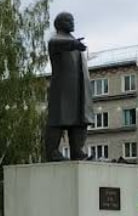

# Как же так вышло...
Сфоткал Ленина в очень большом лесу

Формат флага 
`TyumenCTF{Der_Name_des_Benutzers_der_seine_Hose_vergessen_hat}`
## Решение
По фото и подсказке находим Ленина в отзывах на Google Maps в ближайшем здании, в нашем случае в отзывах к администрации Тайгинского городского округа
**3J8J+5F Тайга, Кемеровская обл.**

Там в комментариях находим текст:

In Taiga, FIFTEEN adventurers could feel the TOTAL pull of nature’s raw beauty. AMBITIOUS spirits thrive here, as if RAPHAEL himself painted the vast forests with bold strokes of inspiration.

По 4 словам (fifteen total ambitious raphael) находим точку на карте, и там из ориентиров будет только Flamingo beach в Антарктиде. Сервис - [wherewords.id](https://wherewords.id/)

И если перейти на Google Maps и полазить в комментариях к этом месту, то можно будет найти нужный нам username:

## Флаг
`TyumenCTF{Andreas_Lukas}`