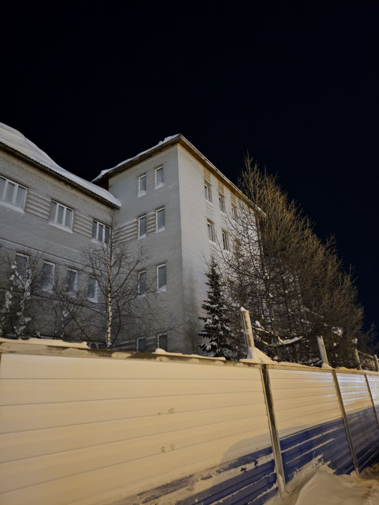

# Старая заброшка
Ветра прошлого гуляют среди этих стен, а мороз хранит их тайны. Здесь царят мороз и вечная мерзлота, а солнце либо не заходит, либо не встает вовсе. Этот край получил свое имя от древнего народа, кочующего по тундре, а поселение названо в честь священного древа.  
Сможешь ли ты найти это место, заброшенное, но не забытое?  

Формат флага `TyumenCTF{кадастровый номер_год постройки}`

## Решение
Для начала нужно разгадать загадку, чтобы понять в каком городе нужно искать здание.
*"Здесь царят мороз и вечная мерзлота, а солнце либо не заходит, либо не встает вовсе"* - это явный намёк на то, что город находится где-то за Полярным кругом.

Поискав информацию о крае, который *"получил свое имя от древнего народа, кочующего по тундре"* можно наткнуться на информацию о **полуострове Ямал**, который получил своё название от древнего народа, кочующего по тундре, — **ненцев**.

Далее мы уже ищем информацию о городе в **ЯНАО**, названном в честь священного древа. Находим название - Лабытнанги. 

Затем переходим на любые онлайн карты и при помощи панорам ищем нужное здание по фото, город достаточно маленький, поэтому много времени это не займёт.

После нахождения здания и нужного нам адреса переходим на любой сайт с публичной кадастровой картой (я использовал - https://miro-map.ru/), вбиваем нужный адрес и получаем информацию о здании.
## Флаг
`TyumenCTF{89:09:010108:327_1994}`